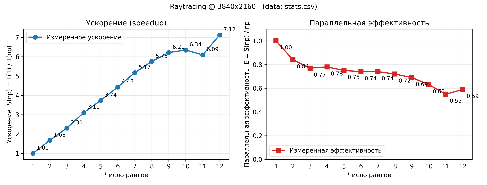

# Ray Tracing

## 1. Структура репозитория

```
ray_tracing/
├── CMakeLists.txt          # сборочная система
├── README.md               # короткая инструкция (англ.)
├── CLAUDE.md               # подсказки для агента Claude Code
├── lib/                    # сюда кладётся локальная сборка OpenMPI
├── scripts/
│   └── benchmark.sh        # запуск серии прогонов и сбор статистики
└── src/
    ├── main.c              # точка входа, MPI-драйвер
    ├── vec3.h              # трёхмерная векторная математика (header-only)
    ├── ray.h               # структура луча и `ray_at`
    ├── scene.h / scene.c   # сцена, материалы, пересечения
    ├── render.h / render.c # камера и трассировка одного пикселя
    └── image_io.h / .c     # обёртка над libpng для записи RGB8-PNG
```

---

[Описание алгоритма трассировки лучей на Википедии](https://ru.wikipedia.org/wiki/%D0%A2%D1%80%D0%B0%D1%81%D1%81%D0%B8%D1%80%D0%BE%D0%B2%D0%BA%D0%B0_%D0%BB%D1%83%D1%87%D0%B5%D0%B9)

---

## 2. Сборка и запуск

### Зависимости

- Компилятор C11 (clang или gcc).
- CMake ≥ 3.16.
- **OpenMPI** должен быть установлен заранее. Если он лежит в `lib/openmpi-install/`, CMake найдёт его автоматически. Иначе нужно задать переменную окружения `MPI_HOME`.
- `zlib` и `libpng` подтягиваются автоматически через `FetchContent` при первом конфигурировании (нужен интернет).

### Команды

```bash
cmake -S . -B build -DCMAKE_BUILD_TYPE=Release
cmake --build build -j12

# Запуск на 4 MPI-процессах
mpirun -np 4 ./build/raytracer                       # пишет out.png
mpirun -np 4 ./build/raytracer --w 1920 --h 1080 --o big.png

# Бенчмарк (формирует stats.csv)
bash scripts/benchmark.sh
```

## 3. Сравнение производительности

Для сравнения производительности используется скрипт ./scripts/benchmark.sh, который автоматически собирает csv файл статистики времени выполнения

|  np |   time_s | speedup | efficiency |
| --: | -------: | ------: | ---------: |
|   1 | 0.651579 |    1.00 |       1.00 |
|   2 | 0.387171 |    1.68 |       0.84 |
|   3 | 0.282330 |    2.31 |       0.77 |
|   4 | 0.209250 |    3.11 |       0.78 |
|   5 | 0.174384 |    3.74 |       0.75 |
|   6 | 0.146937 |    4.43 |       0.74 |
|   7 | 0.125923 |    5.17 |       0.74 |
|   8 | 0.113294 |    5.75 |       0.72 |
|   9 | 0.104974 |    6.21 |       0.69 |
|  10 | 0.102770 |    6.34 |       0.63 |
|  11 | 0.106906 |    6.09 |       0.55 |
|  12 | 0.091517 |    7.12 |       0.59 |



### Конфигурация

| Параметр          | Значение                                                      |
| ----------------- | ------------------------------------------------------------- |
| CPU               | Apple M2 Max (8 performance + 4 efficiency ядер)              |
| OS                | macOS 26.4.1 (build 25E253), darwin arm64                     |
| Компилятор        | Apple Clang 17.0.0                                            |
| MPI               | Open MPI 5.0.9                                                |
| Сборка            | CMake Release: `-O3 -march=native -ffast-math -funroll-loops` |
| Параметры рендера | 3840×2160, best of 3 запусков на каждый `np`                  |
| Полезная нагрузка | ~33 млн первичных лучей × до 3 отскоков + теневые             |

- **P/E-разделение.** M2 Max это 8 performance + 4 efficiency ядер. До `np=8` загружаются только P-ядра (отсюда плавная кривая до 0.72), дальше задействуются E-ядра, которые в этой числовой нагрузке примерно в 2× медленнее. Из-за этого мы наблюдаем падение на `E` с 0.72 (np=8) до 0.55-0.59 на 10-12.

## 4. Выводы

Алгоритм трассировки лучей имеет высокую степень параллелизма, что подтверждается ускорением алгоритма в 7 раз при выполнение на нескольких ядрах. При этом, наблюдается уменьшение относительного процента ускорения в момент, когда начинают использоваться энергоэффективные ядра. 